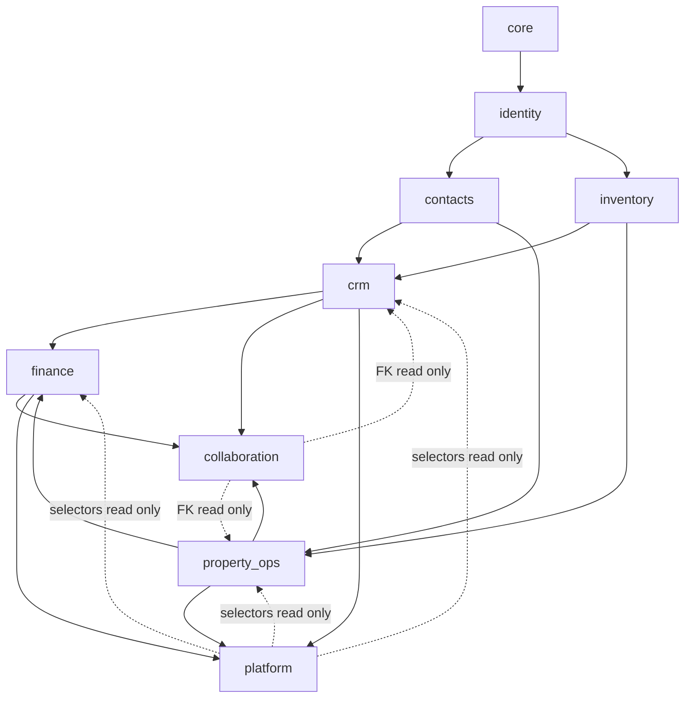

# Real Estate Management System Database Schema & Architecture Specification

> **Version 3.2** (revised Aug 12, 2026). Aligns with SRS 2.1 admin mandatory requirements: Super Admin is highest authority; registration hierarchy Manager → Broker/Owner → Agent; **rental-tenant / portal-client isolation** (not SaaS multi-tenant); portal access only after completed contract; mandatory Property Manager per property; sales-officer GPS field tracking sessions; lead de-dup includes same property + same lead type. Retains v3.1 DAG/schema hardenings.

## Architecture Principles
* **Deployment Scope:** Single real estate company — internal operational monolith (not a multi-company SaaS product).
* **Core Technology:** Modular Django Monolith running on PostgreSQL (with PostGIS) and S3-compatible file storage.
* **Access Isolation:** No SaaS company-partitioning (`tenant_id` as software customer). Access is bounded by a **role-driven row-level scoping model** (see §2) within the one company (branch / team / owner / rental-tenant portal scope). **“Multi-tenant isolation” means rental-tenant / portal-client isolation** — one portal client never sees another’s private data.
* **Authority:** `super_admin` is the **highest authority** (data_scope `ALL` + system governance). Registration hierarchy: Super Admin → Branch/Team Manager → Broker/Agency Owner → Sales/Leasing Agent.
* **Inter-app Communication:** Cross-app dependencies follow a **strict import DAG** (see §1.2). Mutations across apps happen only via the target app’s `services.py`. Money mutations happen only in `finance.services`.
* **DAG enforcement:** Import boundaries MUST be enforced in CI (e.g. import-linter / custom lint). Prose alone is not sufficient.
* **Concurrency & Safety:** Strict database-level constraints, atomic financial operations (`transaction.atomic()`), and row-level locking (`SELECT FOR UPDATE`).
* **Terminology:** **Tenant** means a **rental tenant** (lease party / contact role). **Company** means this brokerage/agency.

---

## 1. Django Application Structure

Nine packages: one technical kernel + eight domain contexts.

```text
backend/
├── config/                 # Django settings, WSGI/ASGI, URL/Celery wiring
├── apps/
│   ├── core/               # BaseModel, SoftDeleteModel, core_sequence, core_custom_field
│   ├── identity/           # Company, branch, team, users, roles, RBAC, portal profiles, ACL, data_scope
│   ├── contacts/           # Buyers, sellers, rental tenants, landlords, vendors, consent, relationships
│   ├── inventory/          # Projects, buildings, properties, units, listings, media, status history
│   ├── crm/                # Marketing, leads, pipelines, deals, viewings, offers, sales transactions, closing checklists
│   ├── property_ops/       # Leases, rent schedules, deposits, renewals, screening, maintenance, vendors
│   ├── finance/            # Invoices, payments, allocations, cheques, commissions, expenses, statements, reconciliation
│   ├── collaboration/      # Documents, e-sign, activities/calendar, communications, notifications
│   └── platform/           # Audit, integrations (MLS/IDX, webhooks), reports/snapshots
└── manage.py
```

### 1.1 Ownership (old → new)

| New app | Owns (logical domains / former apps) | SRS anchors |
| :--- | :--- | :--- |
| `core` | BaseModel, SoftDeleteModel, sequences, custom-field registry | 2.5, 3.17.4 |
| `identity` | former `organization` + `accounts` | 3.15, 3.17 |
| `contacts` | former `contacts` | 3.2 |
| `inventory` | former `properties` | 3.3 |
| `crm` | former `marketing` + `leads` + `sales` | 3.1, 3.4, 3.6 (deal/offer), 3.8 |
| `property_ops` | former `leasing` + `maintenance` | 3.5, 3.14 |
| `finance` | former `finance` | 3.6 (money), 3.5.6 |
| `collaboration` | former `documents` + `activities` + `communications` + `notifications` | 3.7, 3.9, 3.12, 3.18 |
| `platform` | former `audit` + `integrations` + `reports` | 3.10, 3.13, 3.17.3, 3.19 |

Logical table names use the owning app prefix (e.g. `crm_deal`, `property_ops_lease`, `inventory_property`, `identity_user`, `collaboration_file`, `finance_invoice`, `platform_audit_event`). Django `app_label` matches the context name.

#### Mandatory internal packages (fat apps)

These layouts are **normative** (not optional). They keep cohesion without adding more `INSTALLED_APPS`:

```text
apps/crm/
  models/{marketing,leads,pipeline,deals}.py
  services/{marketing,leads,deals}.py
  selectors/  tasks/  api/

apps/property_ops/
  models/{leasing,maintenance}.py
  services/{leases,screening,maintenance}.py
  selectors/  tasks/  api/

apps/collaboration/
  models/{documents,activities,communications,notifications}.py
  services/{documents,activities,communications,notifications}.py
  selectors/  tasks/  api/
```

### 1.2 Communication & Import DAG

Apps do **not** communicate over HTTP internally. They communicate via (1) FK string references, (2) `services` calls, (3) `selectors` reads, (4) Celery tasks. There is no other allowed channel for cross-app writes.

Document **two graphs** — do not conflate them:

1. **Runtime call DAG** — who may call whose `services` / `tasks`  
2. **Schema FK DAG** — which tables may reference which (migration order)

#### Runtime call DAG (services)

```text
core
  └── identity
        ├── contacts ──────────────┐
        └── inventory ─────────────┤
              ├── crm ─────────────┼──► finance ──► collaboration
              └── property_ops ────┘         └──► platform
```



Layers: (1) `core`. (2) `identity`. (3) `contacts` / `inventory` peers. (4) `crm` / `property_ops` peers — **no mutual write services**; lineage FKs allowed. (5) `finance` — sole money writer. (6) `collaboration` / `platform` — satellites; **never call domain write services**; may **FK/read** domain rows.

#### Schema FK / migration notes

* Domain tables may FK to `identity_*`, `contacts_*`, `inventory_*` freely (string refs).
* `collaboration_*` may FK to `crm_*`, `property_ops_*`, `inventory_*`, `contacts_*` (attach-to-record).
* `finance_*` may FK to `crm_*` / `property_ops_*` for invoice/commission/expense lineage.
* `property_ops_lease.transaction_id` → `crm_transaction` is **lineage only**.
* `crm_*` → `collaboration_*` FKs (templates, checklist docs) and `identity_*` → `collaboration_file` (avatar/logo) are **nullable + deferred** until collaboration exists.

#### Public surface per app (mandatory)

```text
apps/<app>/
  models/ or models.py
  services.py (or services/)   # ONLY public write API other apps may import for mutations
  selectors.py (or selectors/) # public reads / scoped querysets
  tasks.py                     # Celery jobs owned by this app
  api/                         # views + serializers — NEVER imported by other apps
```

#### Import matrix (runtime)

| From ↓ \\ To → | core | identity | contacts | inventory | crm | property_ops | finance | collaboration | platform |
| :--- | :---: | :---: | :---: | :---: | :---: | :---: | :---: | :---: | :---: |
| **core** | — | no | no | no | no | no | no | no | no |
| **identity** | models | — | no | no | no | no | no | services | no |
| **contacts** | OK | OK | — | no | no | no | no | services | no |
| **inventory** | OK | OK | FK/read | — | no | no | no | services | no |
| **crm** | OK | OK | OK | OK | — | **no writes** | **services only** | services (+ deferred FKs) | services |
| **property_ops** | OK | OK | OK | OK | **FK/read lineage** | — | **services only** | services | services |
| **finance** | OK | OK | OK | OK | selectors/FK | selectors/FK | — | services | services |
| **collaboration** | OK | OK | FK/read | FK/read | **FK/read** | **FK/read** | **FK/read** | — | services |
| **platform** | OK | OK | selectors | selectors | **selectors** | **selectors** | **selectors** | selectors | — |

*OK* = models/selectors. *services only* = mutations via target `services` only. *FK/read* / *selectors* = read and schema FK allowed; **no domain write services**. *FK/read lineage* = nullable FK to crm deal/transaction set only when creating a lease from a won deal. *deferred FKs* = nullable until collaboration exists.

#### Forbidden patterns

* Cross-app `OtherModel.objects.create/update/delete` outside the owning app’s services
* Importing another app’s `api` / `views` / `serializers`
* `post_save` / signals to create invoices, payments, commissions, or leases
* `crm` inserting/updating `property_ops_*` rows (crm may only *call* `property_ops.services.create_lease_from_deal`)
* `property_ops` calling `crm.services` to mutate deals (read via selectors only)
* `collaboration` / `platform` calling domain write services
* Any app other than `finance` posting money

#### Orchestration examples (required)

* **Convert lead:** `crm.services.convert_lead` creates the deal inside `crm` only.
* **Sale deal won:** `crm.services.mark_deal_won` → `finance.services.create_commission_for_transaction` (and optional sale invoice).
* **Letting/rental deal won:** `crm.services.mark_deal_won` → `property_ops.services.create_lease_from_deal(deal_id=…)` (sets lineage `transaction_id` / deal ref) → then PM activates lease.
* **Activate lease:** `property_ops.services.activate_lease` → `finance.services.generate_rent_schedule_invoices` (sync or task).
* **Letting commission (no sale transaction):** `finance.services.create_commission_for_lease(lease_id=…)` when plan `applies_to` includes RENTAL.
* **Billable maintenance:** `property_ops` → `finance.services.record_expense` → owner statement.
* **Viewing / inspection calendar sync:** `crm.services.schedule_viewing` / `property_ops.services.schedule_inspection` MUST upsert linked `collaboration_activity` via `collaboration.services.upsert_activity_for_source` (UI must not create standalone calendar rows for those types).
* **Notify / audit:** domain service → `collaboration.services.notify_*` / `platform.services.record_event`.

### 1.3 Runtime Architecture

* **Layering:** HTTP (`api/`) → `services` → `selectors`/`models` → PostgreSQL.
* **Workers (Celery):** rent recurrence (`finance`/`property_ops`); SLA sweeps (`crm`); report snapshots and webhook delivery (`platform`); notification dispatch (`collaboration`); MLS/portal sync (`platform`).
* **Idempotency:** finance and integration tasks keyed by business reference codes.
* **Auth:** JWT/session, MFA, SSO hooks live under `identity`.
* **Documents:** S3-compatible object storage; download via signed URLs gated by `collaboration` document ACL.
* **Audit:** append-only `platform_audit_event`; every sensitive service mutation calls `platform.services.record_event` (not model signals alone).
* **Portal API ownership:** Auth + `identity_portal_profile` in `identity`. Buyer/seller deal/offer/favorite/search data from `crm` (+ collaboration docs). Landlord/rental-tenant lease, rent, maintenance, statements from `property_ops` + `finance` via selectors/services. Do **not** invent a tenth “portal” Django app.
* **Import lint:** CI MUST fail on forbidden edges in the runtime matrix above.

---

## 2. Global Database Conventions

Base Model Definition

```python
import uuid
from django.db import models


class BaseModel(models.Model):
    id = models.UUIDField(primary_key=True, default=uuid.uuid4, editable=False)
    created_at = models.DateTimeField(auto_now_add=True)
    updated_at = models.DateTimeField(auto_now=True)
    created_by = models.ForeignKey(
        "identity.User", null=True, blank=True, on_delete=models.SET_NULL, related_name="+"
    )
    updated_by = models.ForeignKey(
        "identity.User", null=True, blank=True, on_delete=models.SET_NULL, related_name="+"
    )

    class Meta:
        abstract = True


class SoftDeleteModel(BaseModel):
    deleted_at = models.DateTimeField(null=True, blank=True)

    class Meta:
        abstract = True
```

**Which abstract base to use**
* **`BaseModel`:** append-only / immutable or hard-delete-ok rows (payments, allocations, account entries, audit, signature events, status history).
* **`SoftDeleteModel`:** contacts, inventory properties/units/listings/media, crm leads/deals/campaigns, property_ops leases (when cancelled/archived), collaboration documents/files (where policy allows), identity users. Always pair with **partial unique indexes** `WHERE deleted_at IS NULL`.
* Posted **finance** money rows never soft-delete — reverse via new entries.

### Universal Rules
Primary Keys: UUID v4 across all tables.

Timestamps: Timezone-aware UTC timestamps (TIMESTAMPTZ).

Financial Fields: Always DecimalField (e.g., max_digits=15, decimal_places=2). Never use floating-point types for monetary values.

Foreign Keys: Use on_delete=models.PROTECT for financial, legal, historical, and transactional records to prevent accidental cascading wipes.

Soft Deletes: Use `SoftDeleteModel.deleted_at` on the soft-delete tables listed above. Combine with partial unique indexes.

Financial Mutability: Never update or physically delete posted payments, allocations, invoices, or audit logs. Handled exclusively via reversing entries.

Document Storage: Store binary files in S3-compatible object storage. Store object metadata and S3 keys in `collaboration_file`. Gallery/listing presentation metadata lives in `inventory_media` (FK to `collaboration_file` once collaboration exists).

### Row-Level Access Scoping Doctrine

Function-level RBAC (`identity_role` / `identity_permission`, owned by **`identity`**) answers *"can this role use this feature?"*. It does **not** answer *"which records may this user see?"*. Because this is a **single-company** system, visibility is enforced at the **application layer** through a mandatory scoping selector that every list/detail endpoint runs through: `identity.selectors.apply_scope(qs, user, resource)`.

Each role carries an explicit **`data_scope`** (never a vague `MODULE` bucket):

| `data_scope` | Typical `identity_role.code` | Derivation |
| :--- | :--- | :--- |
| `ALL` | `super_admin` (**highest authority**), `owner` | No row filter (agency-wide). Super Admin also governs users/security/config. |
| `BRANCH` | `manager` (branch) | owner's / record's `branch_id` = requester’s branch |
| `TEAM` | `manager` (team) | owner's / record's `team_id` = requester’s team |
| `OWN` | `agent` | `assigned_agent_id` / `owner_id` = self (+ shares) |
| `MANAGED_PROPERTIES` | `property_manager` | `inventory_property.managed_by_id` = self; children (leases, maintenance, owner statements) via parent property |
| `FINANCE_ALL` | `finance` | finance objects agency-wide; non-finance modules only as granted by permissions (usually read) |
| `MARKETING_ALL` | `marketing` | campaign/source/landing objects agency-wide; leads per permission/grant |
| `PORTAL_OWN` | `portal` | own data only via `identity_portal_profile.contact_id` — profile granted only after completed contract |

Portal paths by `portal_type` (under `PORTAL_OWN`):
* Eligibility: portal login requires a **completed contract** (closed sale, signed/active lease, or other closed transaction)—not an open lead.
* **Rental tenant:** leases where contact is tenant/party; own maintenance; own documents; own rent invoices/payments. Never another rental tenant’s data.
* **Landlord:** properties via `inventory_property_owner`; leases on those properties; owner statements; related docs.
* **Buyer/Seller:** own closed deals/offers/documents linked to the contact.

Rules:
* Every scoped entity MUST carry an ownership anchor: `assigned_agent_id` (contacts, crm leads, inventory listings), `owner_id` (crm deals), `managed_by_id` (inventory properties), `property_manager_id` (property_ops leases). Child records inherit scope from their parent.
* Explicit cross-user sharing is modeled by `identity_record_share` (§4) and unioned in `apply_scope`.
* Field-level masking is modeled by `identity_field_permission` (§4) and enforced in serializers.
* Postgres RLS keyed on a session GUC is **optional** defense-in-depth for finance tables; the application scoping layer is **mandatory**.
* Money mutations remain restricted to `finance.services` regardless of scope.

### Custom Fields & Extensibility

Admin-defined fields and picklists must be addable without migrations (SRS 2.5 / 3.17.4):
* Every core business entity (contact, lead, deal, property, listing, lease) carries a `custom_data JSONB` column (default `{}`) for ad-hoc values.
* `core_custom_field` (§4, owned by **`core`**) is the registry that describes each custom field (entity_type, key, label, data_type, choices, is_required, is_active) so the UI can render/validate them and admins can manage picklists centrally.

### Reference-Code Generation

Human-readable sequential identifiers (`reference_code`, `invoice_number`, `payment_reference`, cheque/transaction refs) MUST be generated by a **concurrency-safe** mechanism — a dedicated Postgres sequence per series, or a `core_sequence` counter row (owned by **`core`**) updated via `SELECT ... FOR UPDATE` inside the creating transaction — never by `MAX()+1` or app-side counting, which race under load.

### Geospatial

Property (and optionally contact) locations use a PostGIS `geography(Point, 4326)` column (`geo_point`) in addition to the human-readable `latitude`/`longitude`, with a **GiST spatial index** to serve radius / map-drawn / nearest search (SRS 3.3.7) and the 1s-over-1M search target (SRS 5.1). Name/address text search uses Postgres full-text + `pg_trgm` (Elasticsearch intentionally omitted at single-company scale).

### Audit Columns

All mutable business entities standardize on `created_by` and `updated_by` (both `UUID FK identity_user NULL`) plus `created_at`/`updated_at`. Immutable/append-only records (payments, allocations, audit) carry only creation metadata.


### Normative schema additions (locked in v3.1)

These are **not optional gaps** — schemas appear in their owning sections below:

1. **`finance_account_entry`** — append-only ledger per `finance_account` (§11).
2. **FX** — `identity_company.default_currency` + `fx_mode`; payments/allocations/entries carry `exchange_rate` / `amount_base` when multi-currency (§4 / §11).
3. **`finance_installment_plan` + `finance_installment_milestone`** — off-plan / sales schedules on `crm_transaction` (§11); created only via `finance.services`.
4. **`inventory_media`** — property/listing gallery metadata (§8); `file_id` deferred until `collaboration_file` exists.
5. **`crm_lead_routing_rule`** — automated lead assignment (SRS 3.1.5) (§7).
6. **Polymorphic commission source** — `finance_commission` requires exactly one of `transaction_id` or `lease_id` (§11).
7. **Message attachments** — `collaboration_document_link` nullable `thread_id` / `message_id` (§12).
8. **GDPR vs immutability** — erase/anonymize PII on contacts/users; never hard-delete posted money or audit/e-sign skeletons.
9. **`crm_agent_field_session` + `crm_agent_location_point`** — mandatory sales-officer GPS field tracking (SRS 3.16.5–3.16.7) (§9).
10. **Portal eligibility** — `identity_portal_profile` ACTIVE only after completed contract (SRS 3.11.2) (§4).
11. **Mandatory Property Manager** — `inventory_property.managed_by_id` required (SRS 3.3.10) (§8).


## 3. Core Entity Relationships

Logical ownership: User/Branch/Team/Portal → **`identity`**; Contact → **`contacts`**; Property/Listing → **`inventory`**; Lead/Deal/Campaign → **`crm`**; Lease/Maintenance → **`property_ops`**; Invoice/Commission → **`finance`**; Document/Message/Activity/Notification → **`collaboration`**; Audit/Integration/Report → **`platform`**.

```
User (identity)
 ├── Branch / Team
 ├── Lead assignments
 ├── Deal ownership
 ├── Property management
 └── Finance approval

Contact (contacts)
 ├── Lead
 ├── Deal
 ├── Property ownership
 ├── Lease party
 ├── Invoice / Payment / Cheque
 └── Portal profile

Property (inventory)
 ├── Project / Building / Unit
 ├── Owner
 ├── Listing
 ├── Viewing
 ├── Deal
 ├── Lease
 ├── Maintenance request
 └── Expense

Lead (crm)
 ├── Contact
 ├── Assigned agent
 ├── Property preferences
 └── Deal

Deal (crm)
 ├── Contact(s)
 ├── Property/properties
 ├── Viewings
 ├── Offers
 ├── Transaction
 └── Commission

Lease (property_ops)
 ├── Property / Unit
 ├── Tenant / Landlord
 ├── Rent schedules
 ├── Cheque register
 ├── Invoices
 ├── Deposits
 └── Maintenance requests
```

## 4. Identity (Company, Users, Roles)

**Owned by app: `identity`.** Table prefix: `identity_*`.

identity_company
id UUID PK

name VARCHAR

legal_name VARCHAR

registration_number VARCHAR NULL

tax_number VARCHAR NULL

logo_file_id UUID FK collaboration_file NULL

email VARCHAR

phone VARCHAR

website VARCHAR NULL

country VARCHAR

timezone VARCHAR

default_currency VARCHAR

fx_mode VARCHAR (SINGLE_CURRENCY, MULTI_CURRENCY) DEFAULT SINGLE_CURRENCY

address_line_1 VARCHAR NULL

address_line_2 VARCHAR NULL

city VARCHAR NULL

state VARCHAR NULL

postal_code VARCHAR NULL

settings JSONB

created_at TIMESTAMPTZ

updated_at TIMESTAMPTZ

identity_branch
id UUID PK

company_id UUID FK identity_company

name VARCHAR

code VARCHAR UNIQUE

manager_id UUID FK identity_user NULL

phone VARCHAR NULL

is_active BOOLEAN

created_at TIMESTAMPTZ

updated_at TIMESTAMPTZ

identity_team
id UUID PK

branch_id UUID FK identity_branch

name VARCHAR

code VARCHAR

manager_id UUID FK identity_user NULL

is_active BOOLEAN

created_at TIMESTAMPTZ

updated_at TIMESTAMPTZ

identity_user
id UUID PK

email VARCHAR (Partial Unique Index WHERE deleted_at IS NULL)

phone VARCHAR NULL

password VARCHAR

first_name VARCHAR

last_name VARCHAR

avatar_file_id UUID FK collaboration_file NULL

employee_number VARCHAR NULL

job_title VARCHAR NULL

branch_id UUID FK identity_branch NULL

team_id UUID FK identity_team NULL

is_active BOOLEAN

is_staff BOOLEAN

is_superuser BOOLEAN

deleted_at TIMESTAMPTZ NULL

last_login TIMESTAMPTZ NULL

created_at TIMESTAMPTZ

updated_at TIMESTAMPTZ

identity_role
id UUID PK

name VARCHAR

code VARCHAR UNIQUE (super_admin, owner, manager, agent, property_manager, marketing, finance, portal)

description TEXT NULL

is_system_role BOOLEAN

data_scope VARCHAR (ALL, BRANCH, TEAM, OWN, MANAGED_PROPERTIES, FINANCE_ALL, MARKETING_ALL, PORTAL_OWN)

Note: `code` values are the product/UI canonical snake_case role keys (align frontend `RoleKey`). `data_scope` drives `identity.selectors.apply_scope` so custom roles do not require hardcoded role-name switches (see §2). System seed maps: super_admin (**highest authority**)→ALL; owner→ALL (registered under a manager); manager→BRANCH or TEAM; agent→OWN (registered under an owner); property_manager→MANAGED_PROPERTIES; marketing→MARKETING_ALL; finance→FINANCE_ALL; portal→PORTAL_OWN (completed-contract clients only).

Registration hierarchy (SRS 3.15): Super Admin → Branch/Team Manager → Broker/Agency Owner → Sales/Leasing Agent.

identity_permission
id UUID PK

code VARCHAR UNIQUE

module VARCHAR

action VARCHAR

description TEXT NULL

identity_user_role
user_id UUID FK identity_user

role_id UUID FK identity_role

Constraint: UNIQUE(user_id, role_id)

identity_role_permission
role_id UUID FK identity_role

permission_id UUID FK identity_permission

Constraint: UNIQUE(role_id, permission_id)

identity_portal_profile
id UUID PK

user_id UUID FK identity_user UNIQUE

contact_id UUID FK contacts_contact UNIQUE

portal_type VARCHAR (BUYER, SELLER, TENANT, LANDLORD)

eligibility_status VARCHAR (PENDING_CONTRACT, ACTIVE, SUSPENDED) DEFAULT PENDING_CONTRACT

completed_contract_ref_type VARCHAR NULL (TRANSACTION, LEASE)

completed_contract_ref_id UUID NULL

is_verified BOOLEAN

last_access_at TIMESTAMPTZ NULL

Invariant: Portal login allowed only when `eligibility_status=ACTIVE` and a completed contract reference is present (SRS 3.11.2). Open leads never receive ACTIVE portal profiles.

identity_record_share
id UUID PK

entity_type VARCHAR (LEAD, CONTACT, DEAL, PROPERTY, LISTING, LEASE)

entity_id UUID

shared_with_user_id UUID FK identity_user

access_level VARCHAR (VIEW, EDIT)

shared_by UUID FK identity_user

expires_at TIMESTAMPTZ NULL

created_at TIMESTAMPTZ

Constraint: UNIQUE(entity_type, entity_id, shared_with_user_id)

Note: Grants an individual user access to a specific record outside their normal scope, without changing ownership. The QuerySet-scoping service unions owned rows with shared rows.

identity_field_permission
id UUID PK

role_id UUID FK identity_role

entity_type VARCHAR

field_name VARCHAR

access_level VARCHAR (HIDDEN, READ_ONLY, READ_WRITE)

Constraint: UNIQUE(role_id, entity_type, field_name)

Note: Serializer-enforced field masking (e.g., hide net_commission from AGENT, restrict confidential financial fields to FINANCE/MANAGEMENT). Absence of a row = full access subject to module permission.

core_custom_field
id UUID PK

entity_type VARCHAR (CONTACT, LEAD, DEAL, PROPERTY, LISTING, LEASE)

key VARCHAR

label VARCHAR

data_type VARCHAR (TEXT, NUMBER, DATE, BOOLEAN, SINGLE_SELECT, MULTI_SELECT)

choices JSONB NULL

is_required BOOLEAN DEFAULT FALSE

is_active BOOLEAN DEFAULT TRUE

sort_order INTEGER DEFAULT 0

created_at TIMESTAMPTZ

Constraint: UNIQUE(entity_type, key)

Note: Registry describing admin-defined fields/picklists stored in each entity's custom_data JSONB. Lets admins add fields and manage picklists without migrations (SRS 2.5 / 3.17.4). (Lives in the `core` app.)

core_sequence
id UUID PK

key VARCHAR UNIQUE (e.g., INVOICE, DEAL_REF, LISTING_REF, EXPENSE, PAYMENT, OWNER_STATEMENT)

prefix VARCHAR NULL

current_value BIGINT DEFAULT 0

padding INTEGER DEFAULT 6

Note: Concurrency-safe human-readable number generator. Next value obtained via `SELECT ... FOR UPDATE` (or a dedicated Postgres SEQUENCE per key). Prevents duplicate reference codes under concurrent creates. (Lives in the `core` app.)

**Migration ordering note (circular FK resolution):** `identity_user.avatar_file_id` and `identity_company.logo_file_id` (identity) reference `collaboration_file` (collaboration), while `collaboration_file.uploaded_by` references `identity_user`. To avoid a circular non-nullable dependency, both `avatar_file_id` and `logo_file_id` are **nullable** and are added in a **later migration that runs after** `collaboration_file` exists (see Implementation Roadmap). Build order: `core` → `identity` (without avatar/logo FKs) → … → `collaboration` → deferred avatar/logo FKs.


## 5. Contacts

**Owned by app: `contacts`.**

contacts_contact
id UUID PK

contact_type VARCHAR (PERSON, COMPANY)

first_name VARCHAR NULL

middle_name VARCHAR NULL

last_name VARCHAR NULL

company_name VARCHAR NULL

email VARCHAR NULL

secondary_email VARCHAR NULL

phone VARCHAR NULL

secondary_phone VARCHAR NULL

date_of_birth DATE NULL

national_id VARCHAR NULL

tax_number VARCHAR NULL

preferred_language VARCHAR NULL

preferred_contact_method VARCHAR NULL

address_line_1 VARCHAR NULL

address_line_2 VARCHAR NULL

city VARCHAR NULL

state VARCHAR NULL

country VARCHAR NULL

postal_code VARCHAR NULL

latitude DECIMAL NULL

longitude DECIMAL NULL

assigned_agent_id UUID FK identity_user NULL

default_source_id UUID FK crm_lead_source NULL

notes TEXT NULL

custom_data JSONB

is_active BOOLEAN

deleted_at TIMESTAMPTZ NULL

created_by UUID FK identity_user NULL

updated_by UUID FK identity_user NULL

created_at TIMESTAMPTZ

updated_at TIMESTAMPTZ

contacts_contact_role
id UUID PK

contact_id UUID FK contacts_contact

role VARCHAR (BUYER, SELLER, TENANT, LANDLORD, INVESTOR, VENDOR, DEVELOPER, REFERRAL_PARTNER, LEGAL_REPRESENTATIVE, OTHER)

Constraint: UNIQUE(contact_id, role)

contacts_contact_relationship
id UUID PK

from_contact_id UUID FK contacts_contact

to_contact_id UUID FK contacts_contact

relationship_type VARCHAR (SPOUSE, FAMILY_MEMBER, COMPANY_REPRESENTATIVE, LEGAL_REPRESENTATIVE, REFERRAL_SOURCE, PROPERTY_OWNER)

notes TEXT NULL

created_at TIMESTAMPTZ

contacts_consent
id UUID PK

contact_id UUID FK contacts_contact

channel VARCHAR (EMAIL, SMS, WHATSAPP, PHONE, MARKETING)

status VARCHAR (OPTED_IN, OPTED_OUT, PENDING)

source VARCHAR

consented_at TIMESTAMPTZ NULL

withdrawn_at TIMESTAMPTZ NULL

evidence TEXT NULL

Deduplication note (SRS 3.1.3 / 3.1.10 / 3.1.11 / 3.2.x): contact duplicate detection matches on normalized `email`, normalized `phone` (E.164), and `national_id`. `pg_trgm` similarity on name + address provides fuzzy suggestions. Lead duplicates additionally consider **same `target_property_id` + same `lead_type`**. Merge is a service operation that repoints child FKs (leads, deals, documents, consents) to the surviving contact and soft-deletes the merged record; it is audited.

## 6. CRM — Marketing and Lead Sources

**Owned by app: `crm`.**
crm_lead_source
id UUID PK

name VARCHAR

source_type VARCHAR (WEBSITE, FACEBOOK, INSTAGRAM, WHATSAPP, PHONE, WALK_IN, REFERRAL, PROPERTY_PORTAL, CAMPAIGN, MANUAL)

description TEXT NULL

is_active BOOLEAN

crm_campaign
id UUID PK

name VARCHAR

campaign_type VARCHAR

description TEXT NULL

budget DECIMAL NULL

start_date DATE

end_date DATE NULL

status VARCHAR

owner_id UUID FK identity_user

created_at TIMESTAMPTZ

updated_at TIMESTAMPTZ

crm_campaign_metric
id UUID PK

campaign_id UUID FK crm_campaign

metric_date DATE

impressions INTEGER DEFAULT 0

clicks INTEGER DEFAULT 0

leads_generated INTEGER DEFAULT 0

conversions INTEGER DEFAULT 0

cost DECIMAL DEFAULT 0

revenue DECIMAL DEFAULT 0

crm_campaign_step
id UUID PK

campaign_id UUID FK crm_campaign

step_order INTEGER

channel VARCHAR (EMAIL, SMS, WHATSAPP)

delay_days INTEGER DEFAULT 0

template_id UUID FK collaboration_template NULL

subject VARCHAR NULL

body TEXT NULL

is_active BOOLEAN DEFAULT TRUE

Constraint: UNIQUE(campaign_id, step_order)

Note: Drip/nurture sequence steps (SRS 3.8.1). Phase-2 build. `template_id` is nullable and should be added (or validated) only after `collaboration_template` exists — deferred FK, same pattern as identity avatar/logo.

crm_landing_page
id UUID PK

campaign_id UUID FK crm_campaign NULL

slug VARCHAR UNIQUE

title VARCHAR

content JSONB

form_config JSONB

lead_source_id UUID FK crm_lead_source NULL

is_published BOOLEAN DEFAULT FALSE

views INTEGER DEFAULT 0

submissions INTEGER DEFAULT 0

created_by UUID FK identity_user

created_at TIMESTAMPTZ

updated_at TIMESTAMPTZ

Note: Landing pages / microsites with lead-capture forms (SRS 3.8.2). Phase-2 build.

crm_saved_search_alert
id UUID PK

contact_id UUID FK contacts_contact

name VARCHAR

criteria JSONB

frequency VARCHAR (INSTANT, DAILY, WEEKLY)

channel VARCHAR (EMAIL, SMS, WHATSAPP)

is_active BOOLEAN DEFAULT TRUE

last_run_at TIMESTAMPTZ NULL

created_at TIMESTAMPTZ

Note: Saved-search alerts that notify a contact when matching listings appear (SRS 3.8.4). Phase-2 build.

## 7. CRM — Leads and Inquiries

**Owned by app: `crm`.**

crm_lead
id UUID PK

contact_id UUID FK contacts_contact

lead_type VARCHAR (BUY, SELL, RENT_IN, RENT_OUT, INVEST)

status VARCHAR (NEW, CONTACTED, QUALIFIED, NURTURING, CONVERTED, LOST)

source_id UUID FK crm_lead_source NULL

campaign_id UUID FK crm_campaign NULL

assigned_agent_id UUID FK identity_user NULL

assigned_team_id UUID FK identity_team NULL

priority VARCHAR (LOW, MEDIUM, HIGH, URGENT)

score INTEGER DEFAULT 0

title VARCHAR

description TEXT NULL

budget_min DECIMAL NULL

budget_max DECIMAL NULL

preferred_property_type VARCHAR NULL

target_property_id UUID FK inventory_property NULL

preferred_location VARCHAR NULL (deprecated single value; use crm_lead_location_preference for multi-location)

preferred_bedrooms INTEGER NULL

preferred_bathrooms INTEGER NULL

financing_status VARCHAR NULL

expected_timeframe VARCHAR NULL

last_contacted_at TIMESTAMPTZ NULL

next_follow_up_at TIMESTAMPTZ NULL

converted_at TIMESTAMPTZ NULL

lost_reason TEXT NULL

custom_data JSONB

deleted_at TIMESTAMPTZ NULL

created_by UUID FK identity_user NULL

updated_by UUID FK identity_user NULL

created_at TIMESTAMPTZ

updated_at TIMESTAMPTZ

Lead de-dup (SRS 3.1.3 / 3.1.10 / 3.1.11): at capture, match phone/email/name against contacts, and additionally flag duplicates when the same contact identifiers target the **same `target_property_id`** with the **same `lead_type`**.

crm_lead_location_preference
id UUID PK

lead_id UUID FK crm_lead

location VARCHAR

latitude DECIMAL NULL

longitude DECIMAL NULL

radius_km DECIMAL NULL

Constraint: UNIQUE(lead_id, location)

Note: Supports SRS 3.1.7 preferred location(s) — a lead may target several areas; matching (SRS 3.3.8) intersects these with property geo.

crm_lead_assignment
id UUID PK

lead_id UUID FK crm_lead

from_user_id UUID FK identity_user NULL

to_user_id UUID FK identity_user

assigned_by UUID FK identity_user

reason TEXT NULL

assigned_at TIMESTAMPTZ

crm_lead_status_history
id UUID PK

lead_id UUID FK crm_lead

from_status VARCHAR NULL

to_status VARCHAR

changed_by UUID FK identity_user

reason TEXT NULL

changed_at TIMESTAMPTZ

crm_lead_routing_rule
id UUID PK

name VARCHAR

priority INTEGER

is_active BOOLEAN DEFAULT TRUE

criteria JSONB

assign_to_user_id UUID FK identity_user NULL

assign_to_team_id UUID FK identity_team NULL

round_robin BOOLEAN DEFAULT FALSE

created_by UUID FK identity_user NULL

created_at TIMESTAMPTZ

updated_at TIMESTAMPTZ

Note: Automated lead assignment (SRS 3.1.5). `criteria` matches inbound lead attributes (source_id, campaign_id, lead_type, location, score bands, etc.). First matching active rule by ascending `priority` wins. Exactly one of `assign_to_user_id` / `assign_to_team_id` should be set (or team + round_robin among team members). Evaluated only inside `crm.services.ingest_lead` / `assign_lead`.

## 8. Inventory — Properties, Projects, Units, and Listings

**Owned by app: `inventory`.** Table prefix: `inventory_*`.

inventory_property_type
id UUID PK

name VARCHAR

code VARCHAR UNIQUE (APARTMENT, VILLA, TOWNHOUSE, OFFICE, RETAIL, WAREHOUSE, LAND, OTHER)

category VARCHAR (RESIDENTIAL, COMMERCIAL, LAND, INDUSTRIAL)

is_active BOOLEAN DEFAULT TRUE

Note: Previously referenced by `inventory_property.property_type_id` but undefined in v1; defined here.

inventory_project
id UUID PK

name VARCHAR

developer_id UUID FK contacts_contact NULL

description TEXT NULL

location VARCHAR NULL

start_date DATE NULL

expected_completion_date DATE NULL

actual_completion_date DATE NULL

status VARCHAR (PLANNED, UNDER_CONSTRUCTION, COMPLETED, ARCHIVED)

created_by UUID FK identity_user

created_at TIMESTAMPTZ

updated_at TIMESTAMPTZ

inventory_building
id UUID PK

project_id UUID FK inventory_project NULL

name VARCHAR

code VARCHAR

number_of_floors INTEGER NULL

description TEXT NULL

inventory_property
id UUID PK

property_type_id UUID FK inventory_property_type

project_id UUID FK inventory_project NULL

building_id UUID FK inventory_building NULL

is_multi_unit BOOLEAN DEFAULT FALSE

title VARCHAR

description TEXT NULL

address_line_1 VARCHAR

address_line_2 VARCHAR NULL

city VARCHAR

state VARCHAR NULL

country VARCHAR

postal_code VARCHAR NULL

latitude DECIMAL NULL

longitude DECIMAL NULL

geo_point GEOGRAPHY(Point, 4326) NULL

land_area DECIMAL NULL

built_area DECIMAL NULL

bedrooms INTEGER NULL

bathrooms INTEGER NULL

parking_spaces INTEGER NULL

year_built INTEGER NULL

floor_number INTEGER NULL

total_floors INTEGER NULL

amenities JSONB

custom_data JSONB

status VARCHAR (DRAFT, AVAILABLE, OCCUPIED, UNDER_MAINTENANCE, SOLD, ARCHIVED)

managed_by_id UUID FK identity_user

deleted_at TIMESTAMPTZ NULL

created_by UUID FK identity_user

updated_by UUID FK identity_user

created_at TIMESTAMPTZ

updated_at TIMESTAMPTZ

Indexes: GiST spatial index on geo_point (radius/map search, SRS 3.3.7); GIN index on amenities/custom_data.

Invariant: `managed_by_id` is **required** (SRS 3.3.10) — every property has an assigned Property Manager.

inventory_unit
id UUID PK

property_id UUID FK inventory_property

building_id UUID FK inventory_building NULL

unit_number VARCHAR

floor_number INTEGER NULL

unit_type_id UUID FK inventory_property_type NULL

bedrooms INTEGER NULL

bathrooms INTEGER NULL

built_area DECIMAL NULL

parking_spaces INTEGER NULL

sale_price DECIMAL NULL

rent_amount DECIMAL NULL

amenities JSONB

custom_data JSONB

status VARCHAR (AVAILABLE, RESERVED, SOLD, OCCUPIED, UNDER_MAINTENANCE, OFF_MARKET)

deleted_at TIMESTAMPTZ NULL

created_by UUID FK identity_user

updated_at TIMESTAMPTZ

created_at TIMESTAMPTZ

Constraint: Partial Unique Index (property_id, unit_number) WHERE deleted_at IS NULL

Note: Explicit addressable unit for multi-unit properties / off-plan developments (SRS 3.3.6). `property_ops_lease.unit_id` and `property_ops_maintenance_request.unit_id` reference THIS table (not `inventory_property`). A single-unit property may have zero units and be leased/maintained at property level.

inventory_property_status_history
id UUID PK

property_id UUID FK inventory_property NULL

unit_id UUID FK inventory_unit NULL

from_status VARCHAR NULL

to_status VARCHAR

changed_by UUID FK identity_user

reason TEXT NULL

changed_at TIMESTAMPTZ

Note: Availability/status change trail (SRS 3.3.4). Exactly one of property_id/unit_id is set.

inventory_property_owner
id UUID PK

property_id UUID FK inventory_property

contact_id UUID FK contacts_contact

ownership_percentage DECIMAL

is_primary_owner BOOLEAN

start_date DATE

end_date DATE NULL

Constraints: ownership_percentage > 0 AND ownership_percentage <= 100

inventory_listing
id UUID PK

property_id UUID FK inventory_property

unit_id UUID FK inventory_unit NULL

reference_code VARCHAR (Partial Unique Index WHERE deleted_at IS NULL)

listing_type VARCHAR (SALE, RENT, SALE_AND_RENT)

title VARCHAR

description TEXT NULL

asking_price DECIMAL NULL

rent_amount DECIMAL NULL

security_deposit DECIMAL NULL

commission_rate DECIMAL NULL

available_from DATE NULL

published_at TIMESTAMPTZ NULL

expires_at TIMESTAMPTZ NULL

status VARCHAR (DRAFT, ACTIVE, UNDER_OFFER, RESERVED, SOLD, RENTED, OFF_MARKET, EXPIRED)

is_exclusive BOOLEAN DEFAULT FALSE

assigned_agent_id UUID FK identity_user NULL

custom_data JSONB

deleted_at TIMESTAMPTZ NULL

created_by UUID FK identity_user

updated_by UUID FK identity_user

created_at TIMESTAMPTZ

updated_at TIMESTAMPTZ

inventory_media
id UUID PK

property_id UUID FK inventory_property NULL

unit_id UUID FK inventory_unit NULL

listing_id UUID FK inventory_listing NULL

file_id UUID FK collaboration_file NULL

storage_key VARCHAR NULL

media_type VARCHAR (PHOTO, FLOOR_PLAN, VIDEO, DOCUMENT, VIRTUAL_TOUR)

caption VARCHAR NULL

sort_order INTEGER DEFAULT 0

is_primary BOOLEAN DEFAULT FALSE

deleted_at TIMESTAMPTZ NULL

created_by UUID FK identity_user NULL

created_at TIMESTAMPTZ

updated_at TIMESTAMPTZ

Constraints: CHECK (property_id IS NOT NULL OR unit_id IS NOT NULL OR listing_id IS NOT NULL); CHECK (file_id IS NOT NULL OR storage_key IS NOT NULL)

Note: Inventory owns gallery/presentation metadata; binary blobs live in object storage. Prefer `file_id` → `collaboration_file` once collaboration exists (deferred FK). Until then `storage_key` is allowed. Do **not** rely on ad-hoc `collaboration_document_link` alone for listing carousels.

## 9. CRM — Sales Pipeline and Deals

**Owned by app: `crm`.** Table prefixes: `crm_*` (includes former marketing/leads/sales entities).

crm_pipeline
id UUID PK

name VARCHAR

pipeline_type VARCHAR (RESIDENTIAL_SALES, COMMERCIAL_SALES, LEASING, OFF_PLAN)

is_default BOOLEAN DEFAULT FALSE

is_active BOOLEAN DEFAULT TRUE

crm_pipeline_stage
id UUID PK

pipeline_id UUID FK crm_pipeline

name VARCHAR

code VARCHAR

sort_order INTEGER

probability DECIMAL

is_won BOOLEAN DEFAULT FALSE

is_lost BOOLEAN DEFAULT FALSE

required_fields JSONB

crm_deal
id UUID PK

reference_code VARCHAR (Partial Unique Index WHERE deleted_at IS NULL)

lead_id UUID FK crm_lead NULL

primary_contact_id UUID FK contacts_contact

pipeline_id UUID FK crm_pipeline

stage_id UUID FK crm_pipeline_stage

owner_id UUID FK identity_user

title VARCHAR

deal_type VARCHAR

estimated_value DECIMAL

currency VARCHAR

probability DECIMAL

expected_close_date DATE NULL

actual_close_date DATE NULL

lost_reason TEXT NULL

next_action VARCHAR NULL

next_action_due_at TIMESTAMPTZ NULL

custom_data JSONB

status VARCHAR (OPEN, WON, LOST, CANCELLED)

deleted_at TIMESTAMPTZ NULL

created_by UUID FK identity_user

updated_by UUID FK identity_user

created_at TIMESTAMPTZ

updated_at TIMESTAMPTZ

Note: `status = LOST` requires a non-null `lost_reason` (mandatory loss reason, SRS 3.4.5) — enforced at service layer / CHECK.

crm_viewing
id UUID PK

deal_id UUID FK crm_deal NULL

lead_id UUID FK crm_lead NULL

property_id UUID FK inventory_property

agent_id UUID FK identity_user

contact_id UUID FK contacts_contact

scheduled_start TIMESTAMPTZ

scheduled_end TIMESTAMPTZ

location VARCHAR NULL

status VARCHAR (SCHEDULED, CONFIRMED, COMPLETED, CANCELLED, NO_SHOW)

check_in_at TIMESTAMPTZ NULL

check_out_at TIMESTAMPTZ NULL

check_in_latitude DECIMAL NULL

check_in_longitude DECIMAL NULL

feedback TEXT NULL

rating INTEGER NULL

created_by UUID FK identity_user

created_at TIMESTAMPTZ

updated_at TIMESTAMPTZ

Constraint: CHECK (scheduled_end > scheduled_start)

Invariant: Creating/updating/cancelling a viewing MUST call `collaboration.services.upsert_activity_for_source(source_type='VIEWING', source_id=…)`. UI must not create a standalone `collaboration_activity` of type VIEWING without this domain row. `activity_id` on the viewing (optional denormalized FK) may be added as a deferred FK after collaboration exists.

crm_agent_field_session
id UUID PK

agent_id UUID FK identity_user

session_type VARCHAR (SALE_TRIP, VIEWING, FOLLOW_UP, OTHER_FIELD)

status VARCHAR (ACTIVE, COMPLETED, CANCELLED)

started_at TIMESTAMPTZ

ended_at TIMESTAMPTZ NULL

lead_id UUID FK crm_lead NULL

deal_id UUID FK crm_deal NULL

property_id UUID FK inventory_property NULL

viewing_id UUID FK crm_viewing NULL

gps_required BOOLEAN DEFAULT TRUE

gps_enabled BOOLEAN DEFAULT FALSE

notes TEXT NULL

created_at TIMESTAMPTZ

updated_at TIMESTAMPTZ

Invariant (SRS 3.16.5): Sales/Leasing Agents must start a field session with `gps_enabled=TRUE` (device permission granted) before marking sale/viewing field activity in-progress. Managers/owners/admins may read sessions within policy; access is audited.

crm_agent_location_point
id UUID PK

session_id UUID FK crm_agent_field_session

recorded_at TIMESTAMPTZ

latitude DECIMAL

longitude DECIMAL

accuracy_m DECIMAL NULL

geo_point GEOGRAPHY(POINT, 4326) NULL

created_at TIMESTAMPTZ

Rules: Append-only location trail for an active field session. Retention policy configurable by Super Admin.

crm_offer
id UUID PK

deal_id UUID FK crm_deal

property_id UUID FK inventory_property

parent_offer_id UUID FK crm_offer NULL

offered_by_contact_id UUID FK contacts_contact

direction VARCHAR (BUYER_TO_SELLER, SELLER_TO_BUYER)

amount DECIMAL

deposit_amount DECIMAL NULL

conditions JSONB

expires_at TIMESTAMPTZ NULL

status VARCHAR (DRAFT, SUBMITTED, COUNTERED, ACCEPTED, REJECTED, EXPIRED, WITHDRAWN)

submitted_at TIMESTAMPTZ

responded_at TIMESTAMPTZ NULL

Note: `parent_offer_id` chains counter-offers into a negotiation thread (SRS 3.6.1). Each counter is a new row pointing at the offer it responds to; `direction` records who countered whom.

crm_closing_checklist
id UUID PK

deal_id UUID FK crm_deal NULL

transaction_id UUID FK crm_transaction NULL

checklist_type VARCHAR (SALE, RENTAL, OFF_PLAN)

name VARCHAR

status VARCHAR (OPEN, COMPLETED, CANCELLED)

created_by UUID FK identity_user

created_at TIMESTAMPTZ

updated_at TIMESTAMPTZ

crm_closing_checklist_item
id UUID PK

checklist_id UUID FK crm_closing_checklist

title VARCHAR

description TEXT NULL

is_required BOOLEAN DEFAULT TRUE

is_completed BOOLEAN DEFAULT FALSE

completed_by UUID FK identity_user NULL

completed_at TIMESTAMPTZ NULL

due_date DATE NULL

document_id UUID FK collaboration_document NULL

sort_order INTEGER DEFAULT 0

Note: Transaction-type-specific closing checklists (SRS 3.6.6); items can require a linked document (e.g., signed contract, deposit receipt). `document_id` is nullable; enforce/add the FK after `collaboration_document` exists (deferred).

crm_transaction
id UUID PK

deal_id UUID FK crm_deal NULL

property_id UUID FK inventory_property

transaction_type VARCHAR (SALE, RENTAL, LEASE_RENEWAL)

reference_code VARCHAR UNIQUE

gross_amount DECIMAL

currency VARCHAR

transaction_date DATE

closing_date DATE NULL

contract_date DATE NULL

status VARCHAR (PENDING, CONTRACTED, PARTIALLY_PAID, COMPLETED, CANCELLED)

notes TEXT NULL

created_by UUID FK identity_user

created_at TIMESTAMPTZ

updated_at TIMESTAMPTZ

## 10. Property Ops — Leasing

**Owned by app: `property_ops`.** Table prefix: `property_ops_*`.

property_ops_lease
id UUID PK

reference_code VARCHAR UNIQUE

property_id UUID FK inventory_property

unit_id UUID FK inventory_unit NULL

tenant_id UUID FK contacts_contact

landlord_id UUID FK contacts_contact

property_manager_id UUID FK identity_user

transaction_id UUID FK crm_transaction NULL

Note: Optional **lineage only** to a closed crm sales/letting transaction. Set exclusively inside `property_ops.services` after reading the deal/transaction via `crm.selectors` (e.g. after a won leasing deal). `crm` must never write `property_ops_lease` rows.

lease_type VARCHAR (RESIDENTIAL, COMMERCIAL, SHORT_TERM)

start_date DATE

end_date DATE

rent_amount DECIMAL

billing_frequency VARCHAR (MONTHLY, QUARTERLY, YEARLY, CUSTOM)

security_deposit DECIMAL

management_fee DECIMAL NULL

notice_period_days INTEGER NULL

terms JSONB

status VARCHAR (DRAFT, PENDING_SIGNATURE, ACTIVE, EXPIRING, RENEWED, TERMINATED, EXPIRED)

created_by UUID FK identity_user

created_at TIMESTAMPTZ

updated_at TIMESTAMPTZ

Constraints: CHECK (end_date > start_date). Exclusion constraint preventing overlapping active lease periods on the same rentable target — keyed on COALESCE(unit_id, property_id) so both unit-level and whole-property leases are protected (GiST, tstzrange over start/end, WHERE status IN ACTIVE-like states).

property_ops_lease_party
id UUID PK

lease_id UUID FK property_ops_lease

contact_id UUID FK contacts_contact

party_type VARCHAR (TENANT, CO_TENANT, GUARANTOR, LANDLORD)

share_percentage DECIMAL NULL

property_ops_rent_schedule
id UUID PK

lease_id UUID FK property_ops_lease

period_start DATE

period_end DATE

due_date DATE

amount DECIMAL

late_fee_amount DECIMAL DEFAULT 0

status VARCHAR (SCHEDULED, INVOICED, PARTIALLY_PAID, PAID, OVERDUE, WAIVED, CANCELLED)

invoice_id UUID FK finance_invoice NULL

property_ops_deposit
id UUID PK

lease_id UUID FK property_ops_lease

amount DECIMAL

held_amount DECIMAL

refunded_amount DECIMAL DEFAULT 0

deducted_amount DECIMAL DEFAULT 0

status VARCHAR (HELD, PARTIALLY_REFUNDED, FULLY_REFUNDED, FORFEITED)

received_date DATE NULL

refunded_date DATE NULL

notes TEXT NULL

property_ops_inspection
id UUID PK

lease_id UUID FK property_ops_lease

property_id UUID FK inventory_property

inspection_type VARCHAR (MOVE_IN, MOVE_OUT, ROUTINE, MAINTENANCE)

scheduled_date DATE

completed_date DATE NULL

performed_by UUID FK identity_user

condition_summary TEXT NULL

meter_readings JSONB

status VARCHAR (SCHEDULED, IN_PROGRESS, COMPLETED, CANCELLED)

Invariant: Same calendar sync as viewings — `property_ops.services.schedule_inspection` / complete / cancel MUST upsert `collaboration_activity` with `source_type='INSPECTION'`. No orphan INSPECTION calendar rows.

property_ops_application
id UUID PK

property_id UUID FK inventory_property

unit_id UUID FK inventory_unit NULL

applicant_contact_id UUID FK contacts_contact

assigned_to UUID FK identity_user NULL

desired_move_in DATE NULL

proposed_rent DECIMAL NULL

employment_status VARCHAR NULL

stated_income DECIMAL NULL

background_check_status VARCHAR (NOT_STARTED, IN_PROGRESS, PASSED, FAILED, WAIVED)

credit_check_status VARCHAR (NOT_STARTED, IN_PROGRESS, PASSED, FAILED, WAIVED)

screening_result JSONB

status VARCHAR (SUBMITTED, UNDER_REVIEW, APPROVED, REJECTED, WITHDRAWN, CONVERTED)

decided_by UUID FK identity_user NULL

decided_at TIMESTAMPTZ NULL

created_by UUID FK identity_user

created_at TIMESTAMPTZ

updated_at TIMESTAMPTZ

Note: Tenant screening / rental application (SRS 3.5.2). On approval, `status = CONVERTED` links to a created `property_ops_lease`.

property_ops_renewal
id UUID PK

original_lease_id UUID FK property_ops_lease

new_lease_id UUID FK property_ops_lease NULL

status VARCHAR (PROPOSED, NEGOTIATING, ACCEPTED, DECLINED, EXPIRED)

proposed_start_date DATE

proposed_end_date DATE

current_rent DECIMAL

proposed_rent DECIMAL

escalation_type VARCHAR (NONE, FIXED_AMOUNT, PERCENTAGE)

escalation_value DECIMAL NULL

notice_sent_at TIMESTAMPTZ NULL

decided_at TIMESTAMPTZ NULL

created_by UUID FK identity_user

created_at TIMESTAMPTZ

updated_at TIMESTAMPTZ

Note: Lease renewal workflow with rent escalation (SRS 3.5.1/3.5.5). `new_lease_id` is populated once the renewal is accepted and a successor lease is generated; the original lease moves to status RENEWED.


## 11. Operational Finance Engine

**Owned by app: `finance`.** All creates/updates/posts of money go through `finance.services` only (see §1.2).

finance_account
id UUID PK

name VARCHAR

account_type VARCHAR (OPERATING_ACCOUNT, TRUST_ACCOUNT, CASH, MOBILE_MONEY)

account_number VARCHAR NULL

currency VARCHAR

is_active BOOLEAN DEFAULT TRUE

finance_account_entry
id UUID PK

account_id UUID FK finance_account

entry_type VARCHAR (DEBIT, CREDIT)

amount DECIMAL

currency VARCHAR

exchange_rate DECIMAL NULL

amount_base DECIMAL NULL

reference_type VARCHAR NULL (PAYMENT, ALLOCATION, RECONCILIATION, ADJUSTMENT, CHEQUE, COMMISSION)

reference_id UUID NULL

description TEXT NULL

posted_at TIMESTAMPTZ

created_by UUID FK identity_user NULL

created_at TIMESTAMPTZ

Rules: Append-only. Never UPDATE/DELETE a posted entry — reverse with an opposite entry. Reconciliation `closing_balance_system` is derived from SUM of entries for the account (converted to company base currency when `fx_mode=MULTI_CURRENCY`).

finance_commission_plan
id UUID PK

name VARCHAR

plan_type VARCHAR (FLAT_PERCENT, FIXED_AMOUNT, TIERED, SPLIT)

applies_to VARCHAR (SALE, RENTAL, BOTH)

base VARCHAR (GROSS_AMOUNT, NET_AMOUNT, RENT_PERIODS)

rate DECIMAL NULL

config JSONB

is_active BOOLEAN DEFAULT TRUE

created_at TIMESTAMPTZ

updated_at TIMESTAMPTZ

Note: Defines how commission is computed (SRS 3.6.4). `config` holds tier bands / split rules / head-office fee rules for non-flat plans. Referenced by `finance_commission.commission_plan_id`.

finance_invoice
id UUID PK

invoice_number VARCHAR UNIQUE

contact_id UUID FK contacts_contact

deal_id UUID FK crm_deal NULL

lease_id UUID FK property_ops_lease NULL

transaction_id UUID FK crm_transaction NULL

invoice_type VARCHAR (SALE, RENT, COMMISSION, MANAGEMENT_FEE, MAINTENANCE, OTHER)

issue_date DATE

due_date DATE

subtotal DECIMAL

tax_amount DECIMAL

discount_amount DECIMAL

total_amount DECIMAL

amount_paid DECIMAL DEFAULT 0

balance_due DECIMAL

currency VARCHAR

status VARCHAR (DRAFT, ISSUED, PARTIALLY_PAID, PAID, OVERDUE, VOID, CANCELLED)

notes TEXT NULL

created_by UUID FK identity_user

created_at TIMESTAMPTZ

updated_at TIMESTAMPTZ

Constraints: CHECK (total_amount >= 0), CHECK (balance_due = total_amount - amount_paid)

Invariant: `amount_paid` is NOT free-form — it MUST equal SUM(finance_payment_allocation.allocated_amount) for this invoice across non-reversed payments. It is maintained by the allocation service inside `transaction.atomic()` (recommended: a DB trigger on `finance_payment_allocation` insert/reverse recomputes `amount_paid`/`balance_due` and advances `status`). Never write `amount_paid` directly from UI.

finance_invoice_line
id UUID PK

invoice_id UUID FK finance_invoice

description VARCHAR

quantity DECIMAL

unit_price DECIMAL

tax_rate DECIMAL

tax_amount DECIMAL

line_total DECIMAL

property_id UUID FK inventory_property NULL

finance_payment
id UUID PK

payment_reference VARCHAR UNIQUE

payer_id UUID FK contacts_contact

account_id UUID FK finance_account

amount DECIMAL

currency VARCHAR

exchange_rate DECIMAL NULL

amount_base DECIMAL NULL

payment_method VARCHAR (BANK_TRANSFER, CHEQUE, CREDIT_CARD, CASH)

payment_date DATE

external_reference VARCHAR NULL

status VARCHAR (POSTED, REVERSED, REFUNDED)

notes TEXT NULL

recorded_by UUID FK identity_user

created_at TIMESTAMPTZ

Constraint: CHECK (amount > 0)

Note: When `identity_company.fx_mode=SINGLE_CURRENCY`, `currency` must equal `default_currency` and FX fields stay NULL. When `MULTI_CURRENCY`, set `exchange_rate` (payment currency → company base) and `amount_base`.

finance_payment_allocation
id UUID PK

payment_id UUID FK finance_payment

invoice_id UUID FK finance_invoice

allocated_amount DECIMAL

exchange_rate DECIMAL NULL

allocated_amount_base DECIMAL NULL

created_at TIMESTAMPTZ

Constraint: UNIQUE(payment_id, invoice_id), CHECK (allocated_amount > 0)

finance_cheque
id UUID PK

lease_id UUID FK property_ops_lease NULL

payer_id UUID FK contacts_contact

drawer_name VARCHAR

bank_name VARCHAR

cheque_number VARCHAR

amount DECIMAL

cheque_date DATE

status VARCHAR (HELD_IN_SAFE, DEPOSITED, CLEARED, BOUNCED, REPLACED, RETURNED)

deposit_account_id UUID FK finance_account NULL

cleared_at TIMESTAMPTZ NULL

bounced_at TIMESTAMPTZ NULL

bounce_reason TEXT NULL

created_at TIMESTAMPTZ

updated_at TIMESTAMPTZ

finance_commission
id UUID PK

transaction_id UUID FK crm_transaction NULL

lease_id UUID FK property_ops_lease NULL

agent_id UUID FK identity_user

commission_plan_id UUID FK finance_commission_plan

gross_commission DECIMAL

tax_amount DECIMAL

deductions DECIMAL DEFAULT 0

net_commission DECIMAL

status VARCHAR (CALCULATED, PENDING_APPROVAL, APPROVED, REJECTED, PAID)

approved_by UUID FK identity_user NULL

approved_at TIMESTAMPTZ NULL

paid_at TIMESTAMPTZ NULL

created_at TIMESTAMPTZ

updated_at TIMESTAMPTZ

Constraint: CHECK (
  (transaction_id IS NOT NULL AND lease_id IS NULL)
  OR (transaction_id IS NULL AND lease_id IS NOT NULL)
)

Note: Sale commissions use `transaction_id` via `finance.services.create_commission_for_transaction`. Letting/rental commissions use `lease_id` via `finance.services.create_commission_for_lease` when the plan `applies_to` includes RENTAL. Never require a fake `crm_transaction` for rental-only commission.

finance_commission_split
id UUID PK

commission_id UUID FK finance_commission

recipient_type VARCHAR (AGENT, BROKER, REFERRAL_EXTERNAL)

recipient_user_id UUID FK identity_user NULL

recipient_contact_id UUID FK contacts_contact NULL

percentage DECIMAL

amount DECIMAL

Invariant: SUM(percentage) across splits of one commission = 100 (or SUM(amount) = net_commission). Enforced in the commission-approval service; a split with recipient_type AGENT/BROKER sets recipient_user_id, REFERRAL_EXTERNAL sets recipient_contact_id (exactly one populated).

finance_installment_plan
id UUID PK

transaction_id UUID FK crm_transaction

name VARCHAR

currency VARCHAR

total_amount DECIMAL

status VARCHAR (DRAFT, ACTIVE, COMPLETED, CANCELLED)

created_by UUID FK identity_user NULL

created_at TIMESTAMPTZ

updated_at TIMESTAMPTZ

Note: Off-plan / milestone payment schedule for a sales transaction (SRS 3.6.3 / 3.6.8). Created only via `finance.services.create_installment_plan`.

finance_installment_milestone
id UUID PK

plan_id UUID FK finance_installment_plan

label VARCHAR

due_date DATE

amount DECIMAL

percentage DECIMAL NULL

sort_order INTEGER DEFAULT 0

invoice_id UUID FK finance_invoice NULL

status VARCHAR (PENDING, INVOICED, PAID, WAIVED, OVERDUE)

paid_at TIMESTAMPTZ NULL

created_at TIMESTAMPTZ

updated_at TIMESTAMPTZ

Invariant: When status becomes INVOICED, `invoice_id` MUST be set (invoice created by `finance.services`). SUM(amount) of milestones SHOULD equal plan `total_amount` (enforced in service on activate).

finance_expense
id UUID PK

expense_number VARCHAR UNIQUE

property_id UUID FK inventory_property NULL

unit_id UUID FK inventory_unit NULL

lease_id UUID FK property_ops_lease NULL

property_ops_maintenance_request_id UUID FK property_ops_maintenance_request NULL

vendor_contact_id UUID FK contacts_contact NULL

account_id UUID FK finance_account NULL

category VARCHAR (MAINTENANCE, UTILITIES, MANAGEMENT, TAX, INSURANCE, MARKETING, PAYROLL, OTHER)

description VARCHAR

amount DECIMAL

tax_amount DECIMAL DEFAULT 0

currency VARCHAR

expense_date DATE

is_billable_to_owner BOOLEAN DEFAULT FALSE

owner_statement_id UUID FK finance_owner_statement NULL

status VARCHAR (DRAFT, APPROVED, PAID, VOID)

approved_by UUID FK identity_user NULL

document_id UUID FK collaboration_document NULL

created_by UUID FK identity_user

created_at TIMESTAMPTZ

updated_at TIMESTAMPTZ

Constraint: CHECK (amount >= 0)

Note: Operational/property expenses (referenced by §3 "Property ├── Expense"; SRS 3.14.4). Billable expenses roll up onto the owner statement.

finance_owner_statement
id UUID PK

statement_number VARCHAR UNIQUE

owner_contact_id UUID FK contacts_contact

property_id UUID FK inventory_property NULL

period_start DATE

period_end DATE

gross_rent_collected DECIMAL DEFAULT 0

management_fees DECIMAL DEFAULT 0

expenses_total DECIMAL DEFAULT 0

other_deductions DECIMAL DEFAULT 0

net_payable DECIMAL

currency VARCHAR

status VARCHAR (DRAFT, ISSUED, PAID)

issued_at TIMESTAMPTZ NULL

paid_at TIMESTAMPTZ NULL

document_id UUID FK collaboration_document NULL

created_by UUID FK identity_user

created_at TIMESTAMPTZ

updated_at TIMESTAMPTZ

Note: Landlord/owner remittance statement (SRS 3.5.6) — rent collected minus fees/expenses = net payable. Powers PM and Landlord-portal dashboards.

finance_owner_statement_line
id UUID PK

statement_id UUID FK finance_owner_statement

line_type VARCHAR (RENT, MANAGEMENT_FEE, EXPENSE, DEDUCTION, ADJUSTMENT)

description VARCHAR

reference_type VARCHAR NULL

reference_id UUID NULL

amount DECIMAL

occurred_on DATE NULL

Note: Itemized rows behind the statement totals; `reference_type`/`reference_id` link back to the invoice/payment/expense that produced the line.

finance_reconciliation
id UUID PK

account_id UUID FK finance_account

period_start DATE

period_end DATE

opening_balance DECIMAL

closing_balance_statement DECIMAL

closing_balance_system DECIMAL

difference DECIMAL

status VARCHAR (OPEN, IN_PROGRESS, RECONCILED, DISCREPANCY)

reconciled_by UUID FK identity_user NULL

reconciled_at TIMESTAMPTZ NULL

notes TEXT NULL

created_at TIMESTAMPTZ

updated_at TIMESTAMPTZ

Note: Bank/trust/clearing-account reconciliation performed by the Finance role. `difference = closing_balance_statement - closing_balance_system`; RECONCILED requires difference = 0.

## 12. Collaboration — Documents and Electronic Signatures

**Owned by app: `collaboration`.** Table prefix: `collaboration_*`.

collaboration_file
id UUID PK

original_name VARCHAR

storage_key VARCHAR

mime_type VARCHAR

size_bytes BIGINT

checksum VARCHAR

uploaded_by UUID FK identity_user

is_encrypted BOOLEAN DEFAULT FALSE

created_at TIMESTAMPTZ

collaboration_document
id UUID PK

file_id UUID FK collaboration_file

title VARCHAR

document_type VARCHAR (ID_DOCUMENT, PROPERTY_DEED, LISTING_AGREEMENT, OFFER, SALE_CONTRACT, LEASE, INVOICE, RECEIPT, INSPECTION_REPORT, OTHER)

version INTEGER DEFAULT 1

status VARCHAR

uploaded_by UUID FK identity_user

is_confidential BOOLEAN DEFAULT FALSE

deleted_at TIMESTAMPTZ NULL

created_at TIMESTAMPTZ

updated_at TIMESTAMPTZ

collaboration_document_link
id UUID PK

document_id UUID FK collaboration_document

contact_id UUID FK contacts_contact NULL

property_id UUID FK inventory_property NULL

deal_id UUID FK crm_deal NULL

lease_id UUID FK property_ops_lease NULL

transaction_id UUID FK crm_transaction NULL

thread_id UUID FK collaboration_thread NULL

message_id UUID FK collaboration_message NULL

relationship_type VARCHAR

Note: v3 — `thread_id` / `message_id` support message attachments (SRS 3.9). At least one of the polymorphic link targets should be set.

collaboration_access_grant
id UUID PK

document_id UUID FK collaboration_document

role_id UUID FK identity_role NULL

user_id UUID FK identity_user NULL

access_level VARCHAR (VIEW, DOWNLOAD, EDIT)

granted_by UUID FK identity_user

created_at TIMESTAMPTZ

Constraint: CHECK (role_id IS NOT NULL OR user_id IS NOT NULL)

Note: Role/user-level document access control (SRS 3.7.4) — e.g., confidential financial docs visible only to FINANCE/MANAGEMENT. Refines the coarse `is_confidential` boolean.

collaboration_esign_envelope
id UUID PK

document_id UUID FK collaboration_document

provider VARCHAR (INTERNAL, DOCUSIGN, ADOBE_SIGN, OTHER)

external_envelope_id VARCHAR NULL

subject VARCHAR

message TEXT NULL

status VARCHAR (DRAFT, SENT, PARTIALLY_SIGNED, COMPLETED, DECLINED, VOIDED, EXPIRED)

sent_at TIMESTAMPTZ NULL

completed_at TIMESTAMPTZ NULL

expires_at TIMESTAMPTZ NULL

created_by UUID FK identity_user

created_at TIMESTAMPTZ

updated_at TIMESTAMPTZ

collaboration_esign_signer
id UUID PK

envelope_id UUID FK collaboration_esign_envelope

contact_id UUID FK contacts_contact NULL

user_id UUID FK identity_user NULL

name VARCHAR

email VARCHAR

signing_order INTEGER DEFAULT 1

role VARCHAR (SIGNER, APPROVER, WITNESS, CC)

status VARCHAR (PENDING, SENT, VIEWED, SIGNED, DECLINED)

signed_at TIMESTAMPTZ NULL

Constraint: CHECK (contact_id IS NOT NULL OR user_id IS NOT NULL)

collaboration_signature_event
id UUID PK

envelope_id UUID FK collaboration_esign_envelope

signer_id UUID FK collaboration_esign_signer NULL

event_type VARCHAR (CREATED, SENT, VIEWED, SIGNED, DECLINED, COMPLETED, VOIDED, REMINDER_SENT)

ip_address INET NULL

user_agent TEXT NULL

metadata JSONB

occurred_at TIMESTAMPTZ

Rules: Append-only immutable signature/audit trail (SRS 3.7.3/3.7.5). UPDATE/DELETE revoked at DB role level (same policy as platform_audit_event).

## 13. Collaboration — Activities, Calendar, and Tasks

**Owned by app: `collaboration`.** Table prefix: `collaboration_*`.

Model note: `collaboration_activity` is the unified calendar/task record. Specialized domain records (`crm_viewing`, `property_ops_inspection`) own their domain data (feedback, GPS check-in, meter readings) and **must** upsert a linked `collaboration_activity` via `collaboration.services.upsert_activity_for_source` (`source_type`/`source_id`). **Invariant:** UI and APIs MUST NOT create standalone `collaboration_activity` rows with `activity_type` VIEWING or INSPECTION except through that upsert path. Recurring tasks (SRS 3.12.4) use `recurrence_rule` (RFC 5545 RRULE string); external calendar sync (SRS 3.12.1) is handled by `collaboration_calendar_link`.

collaboration_activity
id UUID PK

activity_type VARCHAR (TASK, CALL, MEETING, VIEWING, FOLLOW_UP, INSPECTION, REMINDER)

subject VARCHAR

description TEXT NULL

assigned_to UUID FK identity_user

created_by UUID FK identity_user

start_at TIMESTAMPTZ NULL

due_at TIMESTAMPTZ NULL

completed_at TIMESTAMPTZ NULL

recurrence_rule VARCHAR NULL

reminder_minutes_before INTEGER NULL

reminder_sent_at TIMESTAMPTZ NULL

priority VARCHAR (LOW, MEDIUM, HIGH, URGENT)

status VARCHAR (OPEN, IN_PROGRESS, COMPLETED, CANCELLED)

source_type VARCHAR NULL (VIEWING, INSPECTION)

source_id UUID NULL

contact_id UUID FK contacts_contact NULL

lead_id UUID FK crm_lead NULL

deal_id UUID FK crm_deal NULL

property_id UUID FK inventory_property NULL

lease_id UUID FK property_ops_lease NULL

collaboration_calendar_link
id UUID PK

user_id UUID FK identity_user

provider VARCHAR (GOOGLE, OUTLOOK, ICAL)

external_calendar_id VARCHAR NULL

activity_id UUID FK collaboration_activity NULL

external_event_id VARCHAR NULL

sync_direction VARCHAR (INBOUND, OUTBOUND, BIDIRECTIONAL)

last_synced_at TIMESTAMPTZ NULL

created_at TIMESTAMPTZ

Constraint: UNIQUE(provider, external_event_id)

Note: Maps CRM activities to external calendar events for two-way sync (SRS 3.12.1).

## 14. Property Ops — Maintenance and Vendors

**Owned by app: `property_ops`.** Table prefix: `property_ops_*`.

property_ops_vendor
id UUID PK

contact_id UUID FK contacts_contact UNIQUE

service_category VARCHAR

license_number VARCHAR NULL

rating DECIMAL NULL

is_active BOOLEAN DEFAULT TRUE

property_ops_maintenance_request
id UUID PK

property_id UUID FK inventory_property

unit_id UUID FK inventory_unit NULL

lease_id UUID FK property_ops_lease NULL

reported_by_contact_id UUID FK contacts_contact NULL

reported_by_user_id UUID FK identity_user NULL

title VARCHAR

description TEXT

priority VARCHAR (LOW, MEDIUM, HIGH, EMERGENCY)

status VARCHAR (NEW, ASSIGNED, IN_PROGRESS, WAITING_FOR_PARTS, COMPLETED, CANCELLED)

assigned_vendor_id UUID FK property_ops_vendor NULL

assigned_to UUID FK identity_user NULL

estimated_cost DECIMAL NULL

actual_cost DECIMAL NULL

requested_at TIMESTAMPTZ

resolved_at TIMESTAMPTZ NULL

property_ops_work_order
id UUID PK

property_ops_maintenance_request_id UUID FK property_ops_maintenance_request

vendor_id UUID FK property_ops_vendor

scheduled_at TIMESTAMPTZ NULL

completed_at TIMESTAMPTZ NULL

quoted_amount DECIMAL NULL

approved_amount DECIMAL NULL

final_amount DECIMAL NULL

status VARCHAR

notes TEXT NULL

## 15. Platform — Audit and Security Logs

**Owned by app: `platform`.** Writes via `platform.services.record_event` from domain services.
platform_audit_event
id UUID PK

actor_user_id UUID FK identity_user NULL

action VARCHAR (CREATE, UPDATE, DELETE, VIEW, EXPORT, LOGIN, LOGIN_FAILED, PAYMENT_POSTED, COMMISSION_APPROVED)

entity_type VARCHAR

entity_id UUID NULL

old_values JSONB NULL

new_values JSONB NULL

ip_address INET NULL

user_agent TEXT NULL

created_at TIMESTAMPTZ

Rules: Append-only log table. UPDATE and DELETE permissions revoked at database role level.

## 16. Platform — Integrations and Sync Mapping

**Owned by app: `platform`.**

platform_connection
id UUID PK

name VARCHAR

provider VARCHAR (PROPERTY_FINDER, BAYUT, DUBIZZLE, MLS, GOOGLE, OUTLOOK, WHATSAPP, TWILIO, MAILGUN, DOCUSIGN, WEBHOOK, OTHER)

direction VARCHAR (INBOUND, OUTBOUND, BIDIRECTIONAL)

auth_type VARCHAR (API_KEY, OAUTH2, BASIC, NONE)

credentials_ref VARCHAR NULL

config JSONB

status VARCHAR (ACTIVE, PAUSED, ERROR, DISABLED)

last_sync_at TIMESTAMPTZ NULL

last_error TEXT NULL

created_by UUID FK identity_user

created_at TIMESTAMPTZ

updated_at TIMESTAMPTZ

Note: Defines a configured external integration (portal feed, calendar, messaging, e-sign). `credentials_ref` points at a secret in the secrets manager — secrets are NOT stored in the DB. Referenced by `platform_external_mapping.connection_id` (undefined in v1; defined here).

platform_external_mapping
id UUID PK

connection_id UUID FK platform_connection

entity_type VARCHAR

local_id UUID

external_id VARCHAR

last_synced_at TIMESTAMPTZ NULL

sync_hash VARCHAR NULL

Constraints: UNIQUE(connection_id, entity_type, local_id), UNIQUE(connection_id, entity_type, external_id)

platform_webhook
id UUID PK

connection_id UUID FK platform_connection NULL

direction VARCHAR (INBOUND, OUTBOUND)

event_type VARCHAR

target_url VARCHAR NULL

secret VARCHAR NULL

is_active BOOLEAN DEFAULT TRUE

created_at TIMESTAMPTZ

updated_at TIMESTAMPTZ

Note: Outbound webhooks (notify external systems on CRM events) and inbound webhook registrations (SRS 3.19.2). `secret` used for HMAC signature verification.

platform_sync_log
id UUID PK

connection_id UUID FK platform_connection

entity_type VARCHAR NULL

direction VARCHAR (INBOUND, OUTBOUND)

status VARCHAR (SUCCESS, PARTIAL, FAILED)

records_processed INTEGER DEFAULT 0

records_failed INTEGER DEFAULT 0

started_at TIMESTAMPTZ

finished_at TIMESTAMPTZ NULL

error_detail TEXT NULL

payload_snapshot JSONB

Note: Per-run sync history and error alerting (SRS 3.10.3/3.10.4).

## 17. Collaboration — Communications

**Owned by app: `collaboration`.** Table prefix: `collaboration_*`.

collaboration_template
id UUID PK

name VARCHAR

channel VARCHAR (EMAIL, SMS, WHATSAPP)

subject VARCHAR NULL

body TEXT

variables JSONB

is_active BOOLEAN DEFAULT TRUE

created_by UUID FK identity_user

created_at TIMESTAMPTZ

updated_at TIMESTAMPTZ

Note: Reusable message templates (SRS 3.9.2). Referenced by collaboration_message and crm_campaign_step drip steps.

collaboration_thread
id UUID PK

subject VARCHAR NULL

channel VARCHAR (EMAIL, SMS, WHATSAPP, CALL, MIXED)

contact_id UUID FK contacts_contact NULL

lead_id UUID FK crm_lead NULL

deal_id UUID FK crm_deal NULL

property_id UUID FK inventory_property NULL

assigned_to UUID FK identity_user NULL

last_message_at TIMESTAMPTZ NULL

is_closed BOOLEAN DEFAULT FALSE

created_at TIMESTAMPTZ

updated_at TIMESTAMPTZ

Note: Groups an omni-channel conversation with an external party against a CRM record (SRS 3.9).

collaboration_message
id UUID PK

thread_id UUID FK collaboration_thread

channel VARCHAR (EMAIL, SMS, WHATSAPP)

direction VARCHAR (INBOUND, OUTBOUND)

from_address VARCHAR NULL

to_address VARCHAR NULL

sender_user_id UUID FK identity_user NULL

contact_id UUID FK contacts_contact NULL

template_id UUID FK collaboration_template NULL

subject VARCHAR NULL

body TEXT

status VARCHAR (QUEUED, SENT, DELIVERED, READ, FAILED, RECEIVED)

provider_message_id VARCHAR NULL

sent_at TIMESTAMPTZ NULL

delivered_at TIMESTAMPTZ NULL

created_at TIMESTAMPTZ

Note: Immutable logged message (email/SMS/WhatsApp) — inbound and outbound (SRS 3.9.1). Attachments link via collaboration_document_link.

collaboration_call_log
id UUID PK

thread_id UUID FK collaboration_thread NULL

contact_id UUID FK contacts_contact NULL

lead_id UUID FK crm_lead NULL

user_id UUID FK identity_user

direction VARCHAR (INBOUND, OUTBOUND, MISSED)

phone_number VARCHAR

started_at TIMESTAMPTZ

duration_seconds INTEGER NULL

outcome VARCHAR (CONNECTED, NO_ANSWER, VOICEMAIL, BUSY, FAILED)

recording_file_id UUID FK collaboration_file NULL

notes TEXT NULL

created_at TIMESTAMPTZ

Note: Call activity logging incl. click-to-call outcomes (SRS 3.9.1).

collaboration_internal_note
id UUID PK

author_id UUID FK identity_user

body TEXT

mentions JSONB

contact_id UUID FK contacts_contact NULL

lead_id UUID FK crm_lead NULL

deal_id UUID FK crm_deal NULL

property_id UUID FK inventory_property NULL

lease_id UUID FK property_ops_lease NULL

created_at TIMESTAMPTZ

updated_at TIMESTAMPTZ

Note: Internal team collaboration / @mentions on any record (internal chat & collaboration, SRS 3.9.6).

## 18. Collaboration — Notifications

**Owned by app: `collaboration`.**

collaboration_notification
id UUID PK

recipient_id UUID FK identity_user

type VARCHAR (LEAD_ASSIGNED, TASK_DUE, VIEWING_SCHEDULED, PAYMENT_RECEIVED, COMMISSION_APPROVED, LEASE_EXPIRING, MAINTENANCE_UPDATE, MENTION, SYSTEM)

title VARCHAR

body TEXT NULL

entity_type VARCHAR NULL

entity_id UUID NULL

is_read BOOLEAN DEFAULT FALSE

read_at TIMESTAMPTZ NULL

created_at TIMESTAMPTZ

Note: In-app notification feed (SRS 3.18.1).

collaboration_notification_preference
id UUID PK

user_id UUID FK identity_user

notification_type VARCHAR

in_app_enabled BOOLEAN DEFAULT TRUE

email_enabled BOOLEAN DEFAULT TRUE

sms_enabled BOOLEAN DEFAULT FALSE

push_enabled BOOLEAN DEFAULT TRUE

quiet_hours_start TIME NULL

quiet_hours_end TIME NULL

timezone VARCHAR NULL

Constraint: UNIQUE(user_id, notification_type)

Note: Per-user, per-type channel preferences and quiet hours (SRS 3.18.2).

collaboration_notification_dispatch_log
id UUID PK

notification_id UUID FK collaboration_notification NULL

user_id UUID FK identity_user

channel VARCHAR (IN_APP, EMAIL, SMS, PUSH)

status VARCHAR (QUEUED, SENT, DELIVERED, FAILED, SUPPRESSED_QUIET_HOURS, SUPPRESSED_PREFERENCE)

provider_reference VARCHAR NULL

error_detail TEXT NULL

created_at TIMESTAMPTZ

Note: Delivery audit per channel; records suppression when blocked by preference/quiet hours.

## 19. Platform — Reports and Analytics

**Owned by app: `platform`.**

platform_saved_report
id UUID PK

name VARCHAR

report_type VARCHAR (SALES, LEADS, LISTINGS, FINANCE, LEASING, MAINTENANCE, MARKETING, CUSTOM)

definition JSONB

visibility VARCHAR (PRIVATE, TEAM, BRANCH, ORG)

owner_id UUID FK identity_user

created_at TIMESTAMPTZ

updated_at TIMESTAMPTZ

Note: User-defined/custom report definitions incl. filters, columns, grouping (SRS 3.13.3). `visibility` interacts with the scoping doctrine.

platform_report_schedule
id UUID PK

saved_report_id UUID FK platform_saved_report

frequency VARCHAR (DAILY, WEEKLY, MONTHLY)

next_run_at TIMESTAMPTZ

recipients JSONB

export_format VARCHAR (PDF, XLSX, CSV)

is_active BOOLEAN DEFAULT TRUE

last_run_at TIMESTAMPTZ NULL

created_by UUID FK identity_user

created_at TIMESTAMPTZ

Note: Scheduled report delivery to recipients (SRS 3.13.3).

platform_dashboard_snapshot
id UUID PK

snapshot_type VARCHAR (KPI_DAILY, PIPELINE, LEADERBOARD, FINANCE_SUMMARY)

scope_type VARCHAR (ORG, BRANCH, TEAM, USER)

scope_id UUID NULL

as_of_date DATE

data JSONB

created_at TIMESTAMPTZ

Constraint: UNIQUE(snapshot_type, scope_type, scope_id, as_of_date)

Note: Pre-computed dashboard metrics for fast role dashboards (SRS 3.13.1) at 1M-record scale — avoids recomputing KPIs on every load.


---

### Implementation Roadmap

Build packages in this topological sequence (matches the **runtime call DAG** in §1.2; schema FK notes apply to step D). Deferred FK step (D) resolves circular dependencies into `collaboration_*`.

1. **`core`:** `BaseModel`, `SoftDeleteModel`, `core_custom_field`, `core_sequence`.
2. **`identity`:** Company (without logo FK; include `default_currency` + `fx_mode`), Branch, Team, User (without avatar FK), Role (`code` + explicit `data_scope`), Permission, user/role/permission links, `record_share`, `field_permission`, portal profile. Seed canonical role codes (`super_admin` … `portal`).
3. **`contacts`:** Contact, roles, relationships, consent.
4. **`inventory`:** Property Type, Project, Building, Unit, Property, Owner, Status History, Listing, Media (with `storage_key` until file FK). Enable PostGIS + `pg_trgm` before geo/search columns.
5. **`crm`:** Marketing (Source, Campaign, Metric, Step, Landing Page, Saved-Search Alert) → Lead (+ assignment, status history, location preference, **routing rules**, **target_property_id** de-dup) → Pipeline, Stage, Deal, Viewing, **Agent Field Session + Location Points**, Offer (+ counter-chain), Sales Transaction, Closing Checklist. Won letting deals call `property_ops.services.create_lease_from_deal` (no direct lease inserts).
6. **`property_ops`:** Lease (+ lineage FK to crm transaction), Party, Rent Schedule, Deposit, Inspection, Application/Screening, Renewal → Vendor, Maintenance Request, Work Order.
7. **`finance`:** Account, Account Entry, Commission Plan, Invoice, Line, Payment (+ FX fields), Allocation, Cheque, Commission (transaction **or** lease), Split, Installment Plan + Milestone, Expense, Owner Statement (+ Lines), Reconciliation. **Only this app’s services post money.**
8. **`collaboration`:** File, Document, Link (+ message/thread attachment support), Access Grant, E-sign Envelope/Signer/Signature Event → Activity (`upsert_activity_for_source`), Calendar Link → Template, Thread, Message, Call Log, Internal Note → Notification, Preference, Dispatch Log.
9. **`platform`:** Audit Event → Integration Connection, External Mapping, Webhook, Sync Log → Saved Report, Schedule, Dashboard Snapshot. Report builders read domains via **selectors only**.
10. **(D) Deferred FKs (after `collaboration` exists):**
    - `identity_user.avatar_file_id`, `identity_company.logo_file_id` → `collaboration_file`
    - `inventory_media.file_id` → `collaboration_file` (migrate off `storage_key` where possible)
    - `crm_campaign_step.template_id` → `collaboration_template` (already nullable; enforce FK when live)
    - `crm_closing_checklist_item.document_id` → `collaboration_document` (nullable lineage)
    - optional denormalized `crm_viewing.activity_id` / `property_ops_inspection.activity_id` → `collaboration_activity`
11. **CI:** import-linter (or equivalent) encodes the §1.2 runtime import matrix; PRs that violate edges fail.

**Invariant for all steps:** cross-app writes only via target `services`; `crm` must not insert/update `property_ops_*` except by calling `property_ops.services.create_lease_from_deal`; `property_ops` may set lineage FKs to crm deals/transactions only in that path; money only via `finance.services`; VIEWING/INSPECTION calendar rows only via collaboration upsert from domain services.